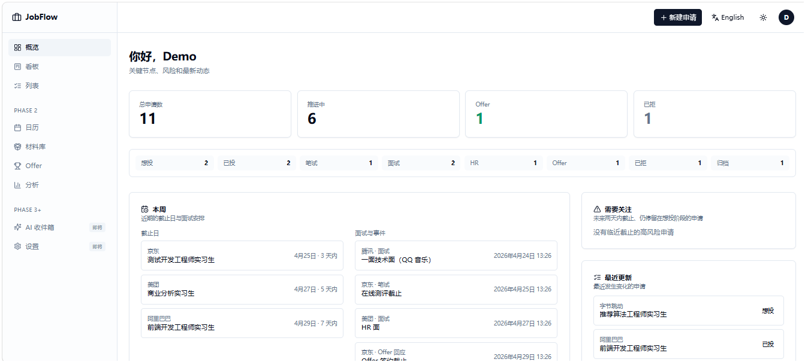
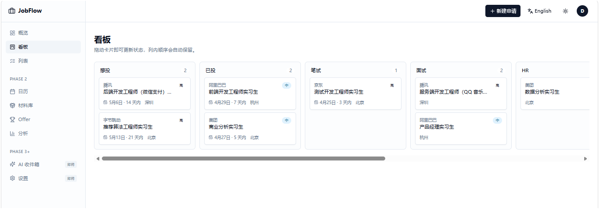
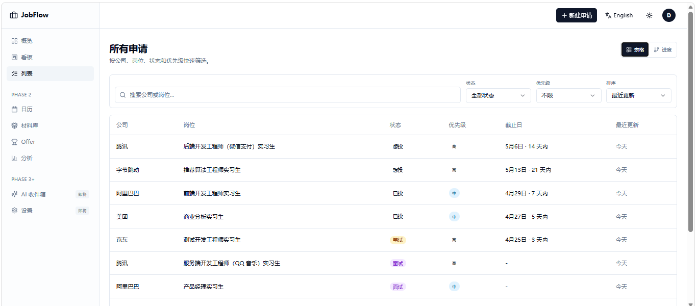
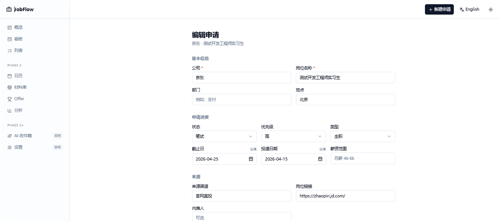
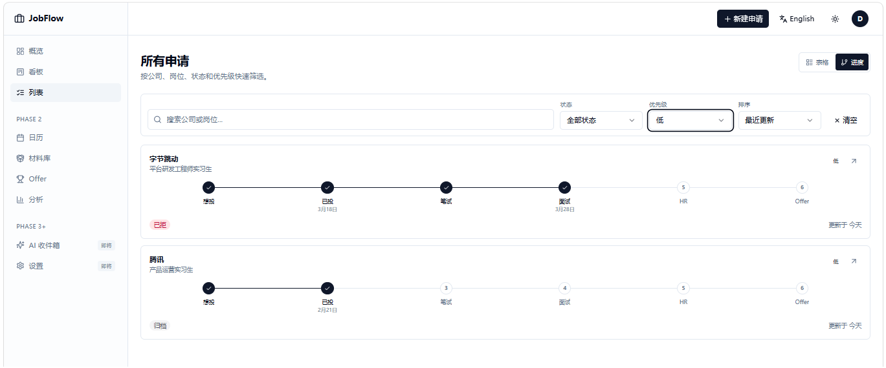
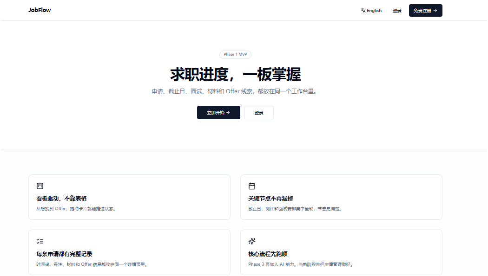

# <div align="center">JobFlow</div>

<p align="center">
  <strong>求职进度，一板掌握。</strong><br>
  面向个人求职者的流程管理工作台
</p>

<p align="center">
  
  
  
  
  
</p>

<p align="center">
  <a href="./README.en.md">English README</a>
</p>

<!-- TODO: docs/assets/screenshots/hero.png -->

---

## 🚀 产品概览

JobFlow 把一条求职流程收进一个清晰可追踪的工作台里：
**Wishlist → Applied → OA → Interview → HR → Offer → Rejected → Archived**。

它聚焦单人求职场景，提供 Dashboard、看板、列表、详情、时间线五种核心视图，支持登录注册、演示账号、本地种子数据、中英双语一键切换，以及以 cookie 持久化的默认中文体验。

当前主线以 **Phase 1 MVP + 修复与体验优化** 为准。本轮不包含 Phase 2、AI、Gmail，也不扩展数据库 schema。阶段记录见 [docs/phase-1.md](./docs/phase-1.md)。

## 🌍 在线演示

- 公开地址：[job-flow-sandy.vercel.app](https://job-flow-sandy.vercel.app/)
- 演示账号：`demo@jobflow.local / demo1234`
- Vercel 自动生成的长域名用于单次部署快照回看，不作为 README 主入口展示
- 自建部署流程见 [部署指南](./docs/deployment.md)

---

## ✨ 核心特点

- `📌` 一条求职流程贯穿到底：从意向到归档，状态切换和记录更新都围绕同一条申请展开。
- `📊` 五种视图互相补位：Dashboard 看全局，Board 推进流程，List 管理筛选，Detail 查单条，Timeline 追踪关键节点。
- `🌐` 中英一键切换：默认中文，按钮单击直接切换，cookie 持久化，不使用 URL locale prefix。
- `🔐` 演示链路可直接跑通：支持 demo 账号登录，也支持新账号注册和注册后继续登录。
- `🛠` 本地开发更顺手：`dev:doctor`、`dev:setup`、`dev:start` 覆盖环境检查、初始化和日常启动。

---

## 🖼 产品截图

<table>
  <tr>
    <td align="center" width="33.33%"><strong>Dashboard</strong></td>
    <td align="center" width="33.33%"><strong>Board</strong></td>
    <td align="center" width="33.33%"><strong>List</strong></td>
  </tr>
  <tr>
    <td></td>
    <td></td>
    <td></td>
  </tr>
  <tr>
    <td align="center"><strong>Detail</strong></td>
    <td align="center"><strong>Timeline</strong></td>
    <td align="center"><strong>Landing</strong></td>
  </tr>
  <tr>
    <td></td>
    <td></td>
    <td></td>
  </tr>
</table>

截图命名规范、补图清单和导出建议见 [docs/assets/README.md](./docs/assets/README.md)。

---

## 🧱 技术栈

| 分组 | 选型 |
|---|---|
| **Frontend** | Next.js 14 App Router · TypeScript strict · Tailwind CSS · Radix UI primitives · dnd-kit |
| **Data** | React Server Components · Server Actions · React Query · zod |
| **Persistence** | Supabase Postgres · Drizzle ORM · drizzle-kit |
| **Auth** | NextAuth v5 · Credentials Provider · JWT session |
| **Tooling** | tsx · dotenv · ESLint · `tsc --noEmit` · `scripts/dev.ts` |

设计取舍、环境变量说明和部署方式见 [docs/faq.md](./docs/faq.md) 与 [docs/deployment.md](./docs/deployment.md)。

---

## ⚡ 快速开始

推荐路径：

```bash
npm install
cp .env.example .env
npm run dev:doctor
npm run dev:setup
npm run dev:start
```

默认地址：

```text
http://localhost:3001
```

执行 `db:seed` 后的默认演示账号：

```text
demo@jobflow.local / demo1234
```

如果 `dev:doctor` 报错，优先检查以下字段：

- `DATABASE_URL`
- `AUTH_SECRET`
- `AUTH_URL`

完整本地运行说明见 [docs/deployment.md](./docs/deployment.md)。

---

## 🗂 项目结构

先看核心目录和关键文件；完整拆解见 [docs/project-structure.md](./docs/project-structure.md)。

```text
app/                                       # 路由入口、布局和页面骨架
├─ layout.tsx                              # 根布局，按 cookie 设置语言与 metadata
├─ page.tsx                                # Landing 页面
├─ providers.tsx                           # Theme / I18n 等全局 Provider
├─ auth/                                   # 未登录链路：登录、注册、跳转
│  ├─ sign-in/page.tsx                     # 登录页入口
│  ├─ sign-in/sign-in-form.tsx             # 登录表单、错误提示、回跳处理
│  ├─ sign-up/page.tsx                     # 注册页入口
│  └─ sign-up/sign-up-form.tsx             # 注册表单、创建账号、注册后登录
├─ api/                                    # 服务端接口：认证、注册、健康检查
│  ├─ auth/[...nextauth]/route.ts          # NextAuth 路由入口
│  ├─ auth/sign-up/route.ts                # 注册接口
│  └─ dev/ready/route.ts                   # 本地环境健康检查
└─ app/                                    # 登录后的主工作区
   ├─ layout.tsx                           # App Shell，挂载 Sidebar / Topbar
   ├─ page.tsx                             # Dashboard 总览
   ├─ board/page.tsx                       # 看板视图
   ├─ list/page.tsx                        # 列表视图
   ├─ applications/                        # 新建、详情、编辑页集合
   ├─ calendar/                            # Phase 2 占位页
   ├─ materials/                           # Phase 2 占位页
   ├─ offers/                              # Phase 2 占位页
   ├─ analytics/                           # Phase 2 占位页
   ├─ ai/                                  # Phase 3 占位页
   └─ settings/                            # 设置与后续扩展入口

components/                                # 跨页面复用组件与基础 UI
├─ app-sidebar.tsx                         # 左侧主导航
├─ app-topbar.tsx                          # 顶部导航与页面动作区
├─ language-switcher.tsx                   # 中英单击切换按钮
├─ phase2-plan.tsx                         # Phase 2 模块占位说明
├─ coming-soon.tsx                         # 通用占位页容器
├─ empty-state.tsx                         # 空列表 / 空搜索状态
├─ status-badge.tsx                        # 状态文案与视觉映射
└─ ui/                                     # 原子级 UI 组件

features/                                  # 业务域代码，按功能聚合
├─ applications/                           # 求职申请主业务域
│  ├─ actions.ts                           # 新建、编辑、状态流转、备注等动作
│  ├─ queries.ts                           # 看板、列表、详情、统计查询
│  ├─ schema.ts                            # 表单与输入校验
│  └─ components/                          # Card / Form / Timeline 等业务组件
└─ dashboard/                              # Dashboard 聚合查询与指标拼装

lib/                                       # 认证、i18n、运行时检查与工具函数
├─ auth.ts                                 # 认证逻辑与登录校验
├─ auth.config.ts                          # NextAuth 配置
├─ auth-helpers.ts                         # requireUser 等辅助方法
├─ auth-route.ts                           # Credentials 回调入口
├─ date.ts                                 # 中英日期格式化
├─ enums.ts                                # 状态、优先级等枚举真源
├─ runtime-env.ts                          # 环境变量与数据库可用性检查
├─ runtime-health-client.ts                # 客户端启动前检查
├─ runtime-health-shared.ts                # 启动自检共享逻辑
└─ i18n/                                   # 字典、Provider、cookie 读写
   ├─ config.ts                            # 语言配置
   ├─ actions.ts                           # 切换语言的 server action
   ├─ client.tsx                           # I18n Provider 与 hook
   ├─ server.ts                            # 服务端字典读取
   └─ dictionaries/
      ├─ zh.ts                             # 中文文案真源
      └─ en.ts                             # 英文字典镜像

db/                                        # 数据库定义、连接与种子数据
├─ schema.ts                               # Drizzle schema
├─ client.ts                               # 数据库连接
├─ seed.ts                                 # 演示数据
└─ migrations/                             # 迁移记录

scripts/                                   # 本地开发与运维脚本
└─ dev.ts                                  # doctor / setup / start

docs/                                      # 中文主文档与英文镜像
├─ deployment.md                           # 中文部署指南
├─ deployment.en.md                        # 英文部署指南
├─ phase-1.md                              # Phase 1 中文记录
├─ phase-1.en.md                           # Phase 1 英文记录
├─ project-structure.md                    # 中文结构说明
├─ project-structure.en.md                 # 英文结构说明
└─ assets/README.md                        # 截图与静态资源规范
```

---

## 📚 文档导航

**🚦 开始使用**
- [README 英文版](./README.en.md)
- [部署指南](./docs/deployment.md)
- [FAQ](./docs/faq.md)

**🧭 项目文档**
- [项目结构说明](./docs/project-structure.md)
- [Roadmap](./docs/roadmap.md)

**📝 阶段记录**
- [Phase 1](./docs/phase-1.md)
- [Phase 2 规划（历史）](./docs/phase-2-plan.md)
- [Next.js 升级评估](./docs/nextjs-upgrade-assessment.md)

---

## 🧪 脚本命令

| 脚本 | 说明 |
|---|---|
| `npm run dev` | 启动开发服务器，端口 `3001` |
| `npm run dev:doctor` | 检查 `.env`、依赖、数据库可达性 |
| `npm run dev:setup` | 仅在需要时执行初始化、迁移和 seed |
| `npm run dev:start` | 推荐入口，先检查再启动开发环境 |
| `npm run build` | 生产构建 |
| `npm start` | 启动生产服务，端口 `3001` |
| `npm run lint` | ESLint |
| `npm run typecheck` | TypeScript 类型检查 |
| `npm run db:generate` | 生成 Drizzle migration |
| `npm run db:push` | 推送 schema 到数据库 |
| `npm run db:studio` | 打开 Drizzle Studio |
| `npm run db:seed` | 注入演示数据 |

---

## 📌 已知边界

- 当前交付范围以 Phase 1 可用闭环为主，不继续扩展 Phase 2、AI、Gmail。
- 单用户定位，不包含团队协作、招聘侧 ATS、自动投递、自动邮件处理。
- 公开演示使用 `https://job-flow-sandy.vercel.app/`，部署快照域名不作为主入口。
- 仓库暂未附带 `LICENSE` 文件，授权方式仍待确定。

---

## ⚖️ License

License: **TBD**。在许可证明确前，使用、修改或分发前请先确认授权范围。
